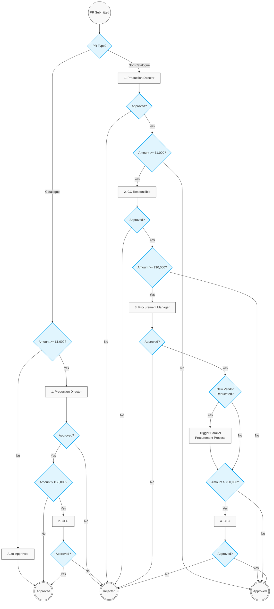

# 01. System Setup & Procurement Approval Matrix

## 1. System Setup Prerequisites

### 1.1. Financial & Organizational Structure
*   **Entity & GL:** Entity setup completed; General Ledger (GL) structure defined.
*   **Accounts:** GL accounts uploaded to the system.
*   **Descriptive Flexfields (DFF):** DFFs configured for each segment of the GL account to capture flexible financial data; DFF data uploaded.
*   **Hierarchy:** Employee list uploaded with reporting hierarchies, financial information (GL accounts), and Cost Centers (CC).

### 1.2. Security & Role Setup
*   **Production Manager:** Granted permissions to create Purchase Requisitions (PR) and initiate Request to Create an Item.
*   **Item Admin:** Granted permissions to create/update items in the master catalog.
*   **Procurement Manager:** Granted permissions to create vendors, contracts, and Purchase Orders (PO).
*   **Approval Matrix:** System routing rules configured based on PR type (Catalogue/Non-Catalogue) and amount thresholds.

---

## 2. Delegation of Authority (Approval Matrix)

**Routing Rule:** All approvals are strictly **sequential**. A Requisition must be approved by the preceding authority level before it is routed to the next tier. The workflow stops routing once the final approver for the respective PR amount has signed off.

| Requisition Type | Amount Threshold (EUR) | Approver (Sequential Step) |
| :--- | :--- | :--- |
| **Catalogue PR** | €0 - €999.99 | Auto-Approval |
| **Catalogue PR** | ≥ €1,000.00 | Step 1: Production Director |
| **Catalogue PR** | > €50,000.00 | Step 2: CFO |
| **Non-Catalogue PR** | €0 - €999.99 | Step 1: Production Director |
| **Non-Catalogue PR** | ≥ €1,000.00 | Step 2: Cost Center (CC) Responsible Person |
| **Non-Catalogue PR** | ≥ €10,000.00 | Step 3: Procurement Manager* |
| **Non-Catalogue PR** | > €50,000.00 | Step 4: CFO |

*\*Note: If a Non-Catalogue PR contains a request for a new vendor, an additional parallel Sourcing process from the Procurement Manager is triggered upon their approval step.*

---

## 3. Sequential Workflow Diagram

---

## 4. Key User Stories

*   **US-SYS-01:** As a System Administrator, I want to configure Descriptive Flexfields (DFF) for GL accounts so that financial data can be captured flexibly according to the entity's structure.
*   **US-AM-01:** As the System, I want to enforce sequential routing so that higher-level executives (e.g., CFO) only review Requisitions that have already been vetted and approved by lower-tier management.
*   **US-AM-02:** As a Procurement Manager, I want to review any Non-Catalogue PR exceeding €10,000 after the CC Responsible has approved it, to ensure compliance before final CFO escalation.

    
