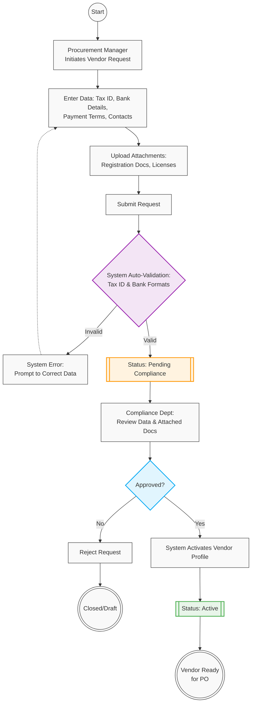

# 02. Vendor Onboarding & Master Data Management

## 1. Business Context
The Vendor Onboarding process is triggered after the Sourcing/RFQ phase is successfully concluded. To ensure compliance and data integrity, the system utilizes an automated validation gateway for financial data (Tax ID, Bank formats) before routing the request and mandatory legal attachments for manual human approval (Compliance/Legal).

## 2. Business Process Flow: Vendor Registration

**Primary Actors:** Procurement Manager (Initiator), System, Compliance Officer.

### Process Steps:
1. **Initiation:** The Procurement Manager opens the *Vendor Management* module and creates a "New Vendor Request".
2. **Data Entry:** The Initiator populates mandatory enterprise fields:
    *   Legal Company Name & Registered Address
    *   Tax Identification Number (e.g., VAT ID)
    *   Bank Details (IBAN, SWIFT/BIC)
    *   Agreed Payment Terms (e.g., Net 30, Net 60)
3. **Document Upload:** The Initiator attaches mandatory scan-copies of legal documents (e.g., Company Registration Certificate, Tax Certificates, Specific Industry Licenses).
4. **Automated System Validation:** Upon clicking *Submit*, the ERP system automatically validates the formatting and checksums of the entered Tax ID and Bank Details.
    *   *Exception:* If the format is invalid, the system instantly rejects the submission and prompts the Initiator to correct the data.
5. **Submission & Routing:** If system validation passes, the status updates to **[Pending Compliance]** and the request is routed to the Compliance department.
6. **Compliance Review:** The Compliance Officer reviews the entered data and verifies the attached legal scan-copies against external sanction lists.
7. **Activation:** Once approved by Compliance, the system creates the Vendor Master Record and updates the status to **[Active]**.

---

## 3. Workflow Diagram

---

## 4. Key User Stories

*   **US-VEN-01:** As the System, I want to automatically validate the format and checksum of the entered Bank Details (IBAN/SWIFT) and Tax ID upon submission, so that invalid financial data is caught without manual human intervention.
*   **US-VEN-02:** As a Procurement Manager, I want to receive an immediate system error if I enter an incorrectly formatted Tax ID, so that I can correct it before it goes to the Compliance queue.
*   **US-VEN-03:** As a Procurement Manager, I must be required to upload attachments (registration documents, licenses) before submitting the vendor request, so that the Compliance team has the necessary files for verification.
*   **US-VEN-04:** As a Compliance Officer, I want to view the attached scan-copies directly within the vendor request, so that I can efficiently verify the legal authenticity of the supplier without requesting files via email.

