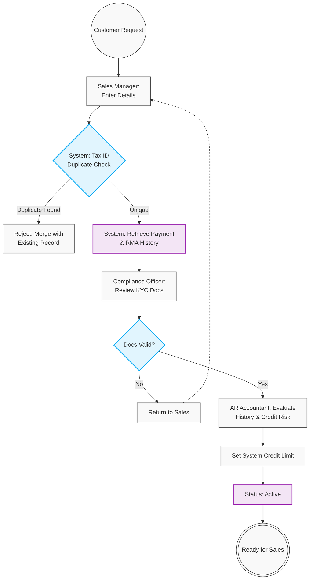

# 04. Customer Onboarding & Credit Management

## 1. Business Context
Before a Sales Order can be processed, a Customer must be formally onboarded to ensure legal compliance (KYC) and mitigate financial risk. The workflow establishes system-enforced Credit Limits based on comprehensive risk profiling, which includes evaluating historical payment delays and the frequency/reasons for past product returns (RMA). It mandates a strict Separation of Duties (SoD) between Sales, Compliance, and Finance.

## 2. Business Process Flow

**Primary Actors:** Sales Manager, Compliance Officer, Accounts Receivable (AR) Accountant, System.

### Process Steps:
1. **Initiation:** The Sales Manager enters the customer's details (Company Name, Registration Number, Tax ID) and requests a target Credit Limit.
2. **Automated Validation & History Retrieval:** 
    *   The system checks for duplicates using the Tax ID.
    *   *History Check:* For returning or existing entities, the system compiles a risk dossier containing historical **Payment Delays (Days Sales Outstanding)** and **RMA History (Return volume and primary root causes)**.
3. **Compliance Review:** The Compliance Officer reviews uploaded legal documents and approves the legal entity status.
4. **Financial Risk Assessment:** The AR Accountant evaluates the requested Credit Limit based on the system's risk dossier (payment/return history) and external credit agency reports.
5. **Activation:** Finance sets the final system Credit Limit. The profile status updates to **[Active]**, unlocking Sales Order creation.

---

## 3. Workflow Diagram

---

## 4. Key User Stories

*   **US-CUST-01:** As the System, I want to automatically block the creation of a new customer if their Tax ID already exists.
*   **US-CUST-02:** As the System, I want to aggregate and display a customer's historical payment delays and RMA records during the onboarding/credit review, so that Finance has complete risk visibility.
*   **US-CUST-03:** As an AR Accountant, I want to set a hard Credit Limit on the customer profile based on their risk assessment, automatically blocking non-compliant Sales Orders.

