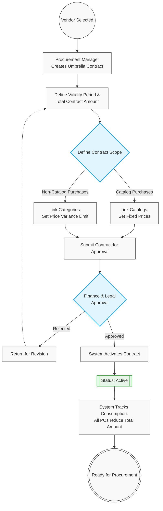

# 03. Contract Management (Framework Agreements)

## 1. Business Context
To streamline purchasing and control enterprise spend, the system utilizes Umbrella Contracts that govern both Catalog and Non-Catalog purchases under a single Total Contract Amount. For Catalog items, prices are strictly fixed. For Non-Catalog purchases, the contract utilizes a **Price Variance** parameter to cap cost fluctuations. All Purchase Requisitions (PRs) and Purchase Orders (POs) linked to the umbrella agreement dynamically consume the predefined total limit.

## 2. Business Process Flow: Contract Creation

**Primary Actors:** Procurement Manager, System, Contract Approver (e.g., Legal / Finance).

### Process Steps:
1. **Initiation:** The Procurement Manager selects an **[Active]** Vendor and defines the umbrella parameters: Validity Period and Total Contract Amount.
2. **Catalog Scope (Fixed Price):** Predefined catalogs are linked to the contract. Prices for these items are locked and will be automatically applied to any referenced PR/PO.
3. **Non-Catalog Scope (Price Variance):** Broad purchasing categories are linked. The Manager configures a **Price Variance** parameter (e.g., maximum allowable % or fixed currency buffer) to control spending limits on non-standard items.
4. **Approval Routing:** The draft contract is routed to Legal and Finance for approval based on the Total Contract Amount.
5. **Activation & Consumption:** Upon final approval, the contract becomes **[Active]**. The system continuously monitors the "Consumed Amount," deducting the value of every new PO from the umbrella total.

---

## 3. Workflow Diagram

## 4. Key User Stories

**US-CTR-01:** As a Procurement Manager, I want to establish an Umbrella Contract with a Total Amount limit, so that all underlying Catalog and Non-Catalog POs draw from a single, approved budget pool.

**US-CTR-02:** As the System, I want to enforce strict Fixed Pricing for any PR/PO items sourced from the linked catalogs, ensuring compliance with negotiated terms.

**US-CTR-03:** As a Finance Controller, I want the system to enforce a predefined Price Variance parameter for Non-Catalog purchases, so that unpredictable spending does not exceed acceptable thresholds.

**US-CTR-04:** As the System, I want to automatically block the creation of new POs if their value would cause the contract's Consumed Amount to exceed the Total Contract Amount.

