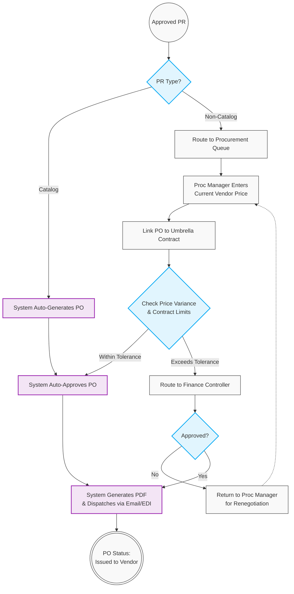

# 03. Purchase Order (PO) Execution

## 1. Business Context
The Purchase Order (PO) generation process employs a dual-path logic based on the nature of the approved Purchase Requisition (PR). For Catalog items with fixed pricing linked to an active Umbrella Contract, the system automatically generates and dispatches the PO (Touchless Procurement). For Non-Catalog items, a Procurement Manager must manually create the PO to confirm current vendor pricing. Non-Catalog POs are subject to an automated Price Variance check against the contract to determine if secondary financial approval is required.

## 2. Business Process Flow: PO Creation & Dispatch

**Primary Actors:** System, Procurement Manager, Finance Controller.

### Process Steps:
1. **Initiation:** The workflow is triggered when a PR receives final approval.
2. **Routing Gateway (Catalog vs. Non-Catalog):**
    *   **Catalog PR:** The system automatically generates the PO using fixed contract prices, auto-approves it, and proceeds to dispatch.
    *   **Non-Catalog PR:** The PR is routed to the Procurement Manager's queue. The Manager confirms current market pricing with the vendor, creates the PO manually, and links it to the Umbrella Contract.
3. **Variance Check & Approval (Non-Catalog Only):**
    *   The system compares the newly entered PO price against the Umbrella Contract's Price Variance tolerance (e.g., maximum 5% deviation) and checks the Total Remaining Contract Value.
    *   *Within Limits:* The PO is automatically approved.
    *   *Exceeds Limits:* The PO is routed to the Finance Controller for secondary approval.
4. **Dispatch:** Once the PO is approved (automatically or manually), the system generates a standard PDF and automatically dispatches it to the Vendor's registered email address (or via EDI).
5. **Closure:** PO status updates to **[Issued to Vendor]**.

---

## 3. Workflow Diagram

## 4. Key User Stories

**US-PO-01:** As the System, I want to automatically generate, approve, and dispatch POs for Catalog PRs linked to an active contract, so that routine purchasing requires zero manual intervention.
**US-PO-02:** As a Procurement Manager, I want to manually enter current pricing for Non-Catalog POs, so that I can accurately reflect negotiated ad-hoc costs before linking them to the Umbrella Contract.
**US-PO-03:** As the System, I want to automatically check Non-Catalog POs against the contract's Price Variance limit, routing exceptions to Finance while auto-approving those within tolerance.
**US-PO-04:** As a Vendor, I want to receive an automated email with the approved PO attached as a PDF, so that I can immediately begin order fulfillment.

