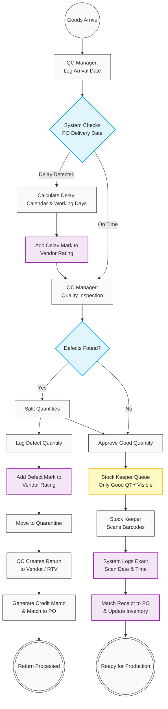

# 04. Goods Receipt, Quality Control (QC) & Returns

## 1. Business Context
The receiving process ensures that only high-quality, strictly verified materials enter the production inventory. It employs a strict Separation of Duties (SoD) between the Quality Control (QC) Manager and the Stock Keeper. The QC Manager evaluates delivery timing and material quality, routing defects to a Quarantine zone and triggering Vendor Rating penalties. The Stock Keeper is restricted to viewing and receiving only the approved "Good" quantity via barcode scanning. Defective items are processed for Return to Vendor (RTV) with an associated Credit Memo.

## 2. Business Process Flow

**Primary Actors:** Quality Control (QC) Manager, Stock Keeper, System.

### Process Steps:
1. **Delivery & Timing Assessment (QC Manager):**
    *   Upon physical delivery, the QC Manager logs the arrival against the Purchase Order (PO).
    *   The system automatically compares the actual delivery date with the PO's agreed delivery date, calculating any delays in both calendar and working days.
    *   *System Action:* Delays are logged as negative marks on the Vendor's Performance Rating profile.
2. **Quality Inspection & Segregation (QC Manager):**
    *   The QC Manager inspects the goods and records the quantities of "Good" vs. "Defected" items.
    *   Defective items are systematically moved to a virtual **[Quarantine]** location.
    *   *System Action:* The defect quantity is logged as a negative mark on the Vendor's Performance Rating profile.
3. **Goods Receipt & Inventory Putaway (Stock Keeper):**
    *   The Stock Keeper accesses the receiving module. The system securely hides any quarantined/defective quantities; the Stock Keeper only sees the "Production Available" (PA) amount (PA = Total Amount - Defected Amount).
    *   The Stock Keeper scans the barcodes of the approved items. The system captures the exact date and time of scanning for each detail.
    *   The system links the Goods Receipt (GR) document to the original PO and updates the active inventory.
4. **Return to Vendor & Credit Memo (QC / Finance):**
    *   For quarantined items, the QC Manager initiates a Return to Vendor (RTV) transaction.
    *   The system generates a Credit Memo request to reverse the financial liability for the defective parts and links it to the original PO.

---

## 3. Workflow Diagram

---

## 4. Key User Stories

**US-QC-01:** As the System, I want to automatically calculate delivery delays in both calendar and working days upon arrival, so that the Vendor's performance rating is accurately and automatically updated.

**US-QC-02:** As a QC Manager, I want to segregate received items into "Good" and "Defective" quantities, routing defects directly to a Quarantine location to prevent them from entering production.

**US-QC-03:** As the System, I want to hide the quantity of quarantined/defective items from the Stock Keeper's view, ensuring they can only scan and receive the approved Production Available (PA) amount.

**US-SK-01:** As a Stock Keeper, I want to scan item barcodes to receive them into inventory, with the system automatically recording the exact date and timestamp for each scanned detail.

**US-FIN-01:** As a QC Manager, I want to initiate a Return to Vendor (RTV) for quarantined items which automatically generates a Credit Memo linked to the PO, so that we do not pay for defective goods.

