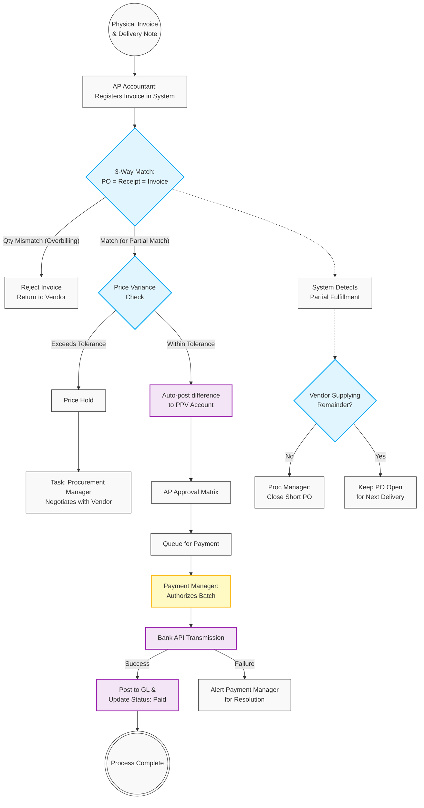

# 05. AP Invoice Matching & Payment Execution

## 1. Business Context
The Accounts Payable (AP) process ensures strict financial compliance through a rigorous 3-Way Match logic (Purchase Order = Goods Receipt = Invoice). It enforces a clear Separation of Duties (SoD) between Warehouse logistics, AP Accounting, and Treasury (Payment Managers). The system automatically handles acceptable price tolerances via Purchase Price Variance (PPV) accounts, routes discrepancies for procurement resolution, and executes secure payments via Bank API integrations.

## 2. Business Process Flow

**Primary Actors:** AP Accountant, System, Procurement Manager, Payment Manager.

### Process Steps:
1. **Invoice Registration (AP Accountant):**
    *   The AP Accountant receives the physical/electronic invoice and the Delivery Note marked as processed by the Stock Keeper.
    *   The Accountant enters the invoice into the system (Status: **[Initiated/New]**) and links it to the corresponding PO and Goods Receipt.
2. **Systematic 3-Way Match & Variance Handling:**
    *   **Quantity Match:** The system verifies Invoice Quantity against Receipt Quantity. If the Invoice bills for more than received, the system blocks processing; the physical invoice is rejected and returned to the vendor. If Invoice Qty = Receipt Qty (even for partial PO fulfillment), it proceeds.
    *   **Price Match & Tolerance:** The system compares the Invoice Price to the PO Price.
        *   *Within Tolerance:* Minor deviations (e.g., < 1%) are automatically allocated to a PPV (Purchase Price Variance) account.
        *   *Out of Tolerance:* The invoice is placed on **[Price Hold]**. A task is routed to the Procurement Manager to resolve the discrepancy with the vendor (e.g., request a Credit Memo).
3. **PO Balance Management (Close Short):**
    *   For partial deliveries, if the vendor will not supply the remaining balance, the Procurement Manager executes a **Close Short** action. The PO is closed, releasing committed funds and negatively impacting the Vendor Rating, while preserving the original PO quantity for audit trails.
4. **Financial Approval:**
    *   Successfully matched invoices enter the AP Approval Matrix based on the total payment amount and cost center.
5. **Payment Execution (Payment Manager):**
    *   Approved invoices are queued for payment. The Payment Manager reviews the batch and authorizes the fund release.
    *   The system transmits payment instructions directly to the bank via API.
    *   Upon bank confirmation, the invoice status updates to **[Paid]**, and the system automatically posts the final entries to the General Ledger (GL).

---

## 3. Workflow Diagram

___

## 4. Key User Stories

 *   **US-AP-01:** As an AP Accountant, I want to link a new invoice to an existing PO and Goods Receipt, so that the system can automatically perform a 3-Way Match.
 *   **US-AP-02:** As the System, I want to automatically allocate minor invoice price discrepancies to a PPV account based on predefined tolerance rules, so that minor rounding issues do not halt the payment process.
 *   **US-AP-03:** As a Procurement Manager, I want to receive a system notification when an invoice is placed on Price Hold, so that I can contact the vendor to request a corrected invoice or Credit Memo.
 *   **US-AP-04:** As a Procurement Manager, I want the ability to perform a "Close Short" on a partially fulfilled PO, so that unused budget is released and the vendor's failure to deliver the full quantity is permanently recorded for rating purposes.
 *   **US-FIN-01:** As a Payment Manager, I want to authorize approved invoice batches for payment, so that the system can automatically transmit payment instructions to the bank via API.

