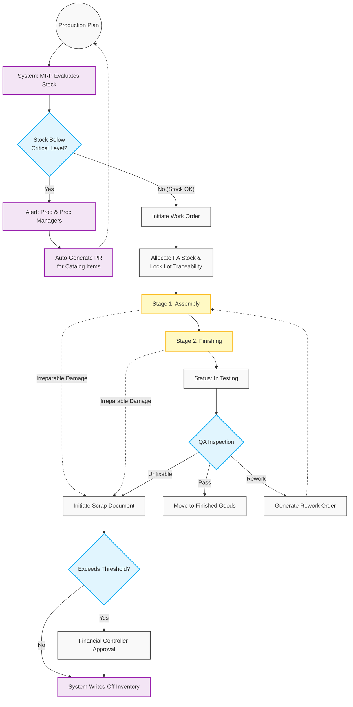

# 06. Manufacturing Execution & Quality Assurance

## 1. Business Context
The Manufacturing module is driven by a **Production Plan (Master Production Schedule - MPS)**. To prevent production downtime, the system utilizes Material Requirements Planning (MRP) logic: it continuously monitors inventory levels against the Production Plan. When component stock approaches critical minimums, the system automatically triggers alerts and generates Purchase Requisitions (PRs) for catalog items.

Once materials are secured, production transforms raw materials into Finished Goods (FG) utilizing multi-stage routings, ensuring End-to-End Lot Traceability. QA Engineers or Production Managers can initiate Scrap documents for defects, subject to financial approval, while fixable defects trigger Rework Orders.

## 2. Business Process Flow

**Primary Actors:** Production Manager, QA Engineer, Financial Controller, System (MRP).

### Process Steps:
1. **Production Planning & Automated MRP (System/Production Manager):**
    *   The Production Manager defines the long-term **Production Plan**.
    *   *Automated MRP Check:* The system calculates required BOM components. If the projected "Production Available" (PA) stock falls below the critical threshold:
        *   **Alerts:** System dispatches urgent notifications to the Production Manager and Procurement Manager.
        *   **Auto-PR:** For catalog items, the system automatically generates a PR.
2. **Initiation & Allocation:**
    *   The Production Manager creates a **Production Work Order (WO)** based on the BOM and multi-stage Routing.
    *   The system allocates PA stock and securely locks Lot/Batch traceability.
3. **Multi-Stage Execution (WIP):**
    *   **Stage 1 (Assembly):** Components are consumed. If a monolithic part is irreparably damaged, the Production Manager can immediately initiate a **Scrap Document**.
    *   **Stage 2 (Finishing):** The unit moves to the next routing step.
4. **QA Testing Gateway:**
    *   Upon routing completion, status updates to **[In Testing]**. The QA Engineer evaluates the output.
5. **Outcome Routing:**
    *   *Scenario A (Pass):* The batch is approved. System generates an FG Receipt. Status: **[Completed]**.
    *   *Scenario B (Rework):* QA identifies fixable defects. A **Rework Order** returns units to WIP.
    *   *Scenario C (Scrap):* QA initiates a **Scrap Document** for unfixable defects. 
6. **Financial Scrap Approval:**
    *   Scrap Documents exceeding predefined financial limits route to the Financial Controller for write-off approval.

---

## 3. Workflow Diagram

---

## 4. Key User Stories

  *   **US-MRP-01:** As the System, I want to continuously monitor inventory levels against the Production Plan, so that I can send critical low-stock alerts to Production and Procurement Managers before a line stoppage occurs.
 *   **US-MRP-02:** As the System, I want to automatically generate Purchase Requisitions for catalog items when stock drops below minimum thresholds, so that routine replenishment happens without manual intervention.
 *   **US-MFG-01:** As a Production Manager, I want the Work Order to follow a multi-stage routing path, so that I can track work-in-progress accurately.
 *   **US-MFG-02:** As a Production Manager, I want to initiate a Scrap Document during assembly for parts that break, so that inventory is immediately corrected.
 *   **US-QA-01:** As a QA Engineer, I want the ability to trigger a Rework Order targeting a specific prior manufacturing stage, so that fixable products are efficiently corrected.
 *   **US-QA-02:** As a QA Engineer, I want to initiate a Scrap Document for completed units that fail final inspection.
 *   **US-FIN-02:** As a Financial Controller, I want to approve any Scrap Documents exceeding our financial threshold, ensuring high-value write-offs are audited.

