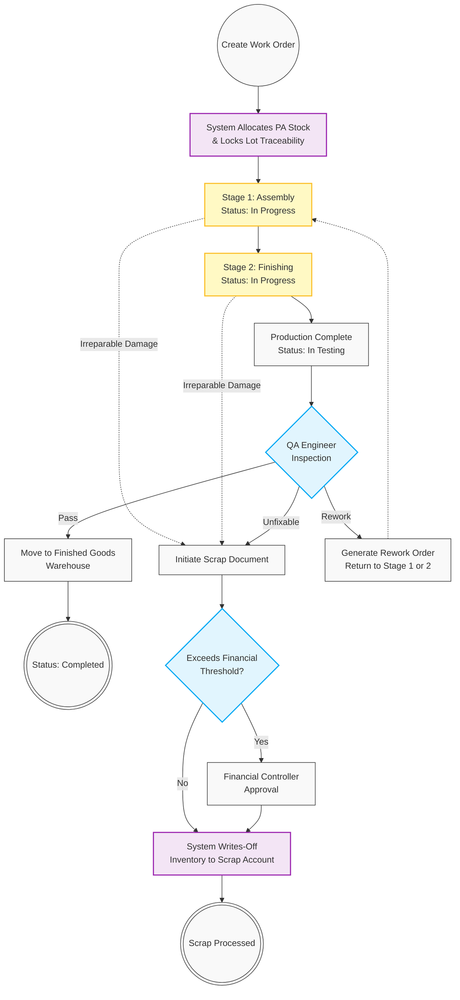

# 06. Manufacturing Execution & Quality Assurance

## 1. Business Context
The Manufacturing module transforms raw materials into Finished Goods (FG) utilizing multi-stage production routings (e.g., Stage 1: Assembly, Stage 2: Calibration/Finishing). This scalable architecture supports End-to-End Traceability, locking the exact batch/lot numbers and receipt dates for every consumed component. 

To accommodate varying product complexities (from reworkable assemblies to monolithic components), the system allows both Production Managers and QA Engineers to initiate "Scrap" documents if irreversible defects occur at any stage. Completed batches must pass a final Quality Assurance (QA) gateway before transferring to FG inventory, while fixable defects trigger a Return to Production (Rework) order.

## 2. Business Process Flow

**Primary Actors:** Production Manager, QA Engineer, Financial Controller, System.

### Process Steps:
1. **Initiation & Allocation (Production Manager):**
    *   The Production Manager creates a **Production Work Order (WO)** based on the Bill of Materials (BOM) and multi-stage Routing template.
    *   *System Check:* Verifies "Production Available" (PA) stock and securely allocates components, locking Lot/Batch traceability.
2. **Multi-Stage Execution (WIP):**
    *   **Stage 1 (Assembly):** Components are consumed. If a monolithic part is irreparably damaged during assembly, the Production Manager can immediately initiate a **Scrap Document** for that specific item.
    *   **Stage 2 (Finishing):** The assembled unit moves to the next routing step. Status updates continuously within **[In Progress]**.
3. **QA Testing Gateway:**
    *   Upon completion of all routing stages, the batch status updates to **[In Testing]**. The QA Engineer evaluates the output.
4. **Outcome Routing:**
    *   *Scenario A (Pass):* The QA Engineer approves the batch. The system generates an FG Receipt, moving items to the FG Warehouse. Status: **[Completed]**.
    *   *Scenario B (Rework):* QA identifies fixable defects. A **Rework Order** is generated, returning the specific units to the appropriate WIP stage for correction.
    *   *Scenario C (Scrap Initialization):* QA identifies irreparable defects. The QA Engineer initiates a **Scrap Document**. 
5. **Financial Scrap Approval:**
    *   All Scrap Documents (whether initiated by Production or QA) that exceed a predefined financial threshold are routed to the Financial Controller for final write-off approval before the inventory valuation is reduced.

---

## 3. Workflow Diagram

---

## 4. Key User Stories

  *   **US-MFG-01:** As a Production Manager, I want the Work Order to follow a multi-stage routing path (e.g., Assembly then Finishing), so that I can track work-in-progress accurately across different factory departments.
  *   **US-MFG-02:** As a Production Manager, I want the ability to initiate a Scrap Document during the assembly stage for monolithic parts that break, so that inventory is immediately corrected without waiting for final QA.
  *   **US-QA-01:** As a QA Engineer, I want the ability to partially reject a production batch and trigger a Rework Order targeting a specific prior manufacturing stage, so that fixable products are efficiently corrected.
  *   **US-QA-02:** As a QA Engineer, I want to initiate a Scrap Document for completed units that fail final inspection and cannot be reworked, ensuring defective items never reach Finished Goods.
  *   **US-FIN-02:** As a Financial Controller, I want to approve any Scrap Documents exceeding our financial threshold, so that high-value inventory write-offs are financially audited before posting to the general ledger.

