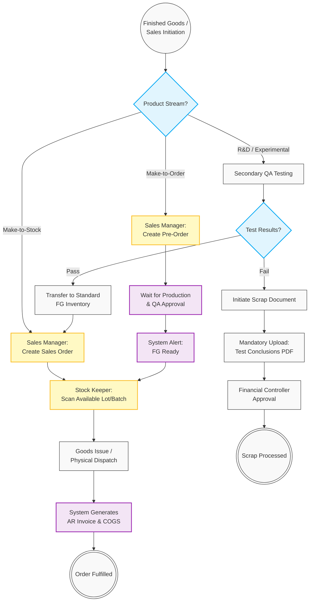

# 07. Finished Goods, Order Fulfillment & Sales

## 1. Business Context
The Order Fulfillment module manages the lifecycle of Finished Goods (FG) across three distinct operational streams: **Make-to-Stock** (standard inventory awaiting sale), **Make-to-Order** (pre-orders awaiting production completion), and **R&D / Experimental** (quarantined batches awaiting secondary QA testing). 

To ensure warehouse efficiency and prevent system bottlenecks, the picking strategy avoids rigid system-enforced FIFO; instead, Stock Keepers manually select available physical units, and the system dynamically records the exact Lot/Batch barcodes scanned, preserving End-to-End Traceability. Furthermore, to comply with strict revenue recognition standards (IFRS 15), final Accounts Receivable (AR) Invoices are only generated upon physical dispatch (Goods Issue), not at the time of Sales Order creation.

## 2. Business Process Flow

**Primary Actors:** Sales Manager, Stock Keeper, QA (Secondary Lab), System.

### Process Steps:
**Stream A: Make-to-Stock (Standard Orders)**
1. **Initiation:** The Sales Manager creates a **Sales Order (SO)** for items currently available in the FG Warehouse.
2. **Picking:** The Stock Keeper receives a Pick List. They physically select available boxes and scan the Lot/Batch barcodes. The system locks these specific units to the SO.
3. **Dispatch & Invoicing:** The Stock Keeper finalizes the shipment (Goods Issue). The system automatically deducts inventory (Cost of Goods Sold), generates the final **AR Invoice**, and links all prior traceability documents (Vendor PO $\rightarrow$ Mfg Work Order $\rightarrow$ Sales Order).

**Stream B: Make-to-Order (Pre-Orders)**
1. **Initiation:** The Sales Manager creates a Sales Order before FG inventory exists. The SO remains in a **[Pending Production]** status.
2. **Production Sync:** Once the Production Manager and QA approve the specific batch, the system alerts the Sales Manager that the reserved FG is ready.
3. **Fulfillment:** The process merges into the standard Picking and Dispatch workflow.

**Stream C: R&D / Experimental (Secondary QA)**
1. **Testing:** Experimental batches are routed to a specialized warehouse location for secondary QA testing.
2. **Outcome - Pass:** If the batch passes, QA updates the status. The system marks the Lot as standard FG, making it visible and available for the Sales Manager to link to an SO.
3. **Outcome - Fail (Scrap):** If the batch fails, QA initiates a **Scrap Document**. The system enforces a mandatory file upload (scan-copies of testing conclusions) before routing the write-off for Financial Controller approval.

---

## 3. Workflow Diagram

---

## 4. Key User Stories

*   **US-SO-01:** As a Sales Manager, I want to create a Sales Order for pre-ordered goods and have the system alert me the moment QA approves the production batch, so that fulfillment is not delayed.
*   **US-WH-01:** As a Stock Keeper, I want to manually scan the barcodes of the units I pick rather than being forced by the system to find the oldest FIFO box, ensuring physical warehouse constraints do not block system workflows.
*   **US-FIN-03:** As the System, I want to delay the generation of the final AR Invoice until the exact moment of physical dispatch (Goods Issue), ensuring revenue is recognized strictly according to accounting standards.
*   **US-QA-03:** As a QA Engineer, I must be required by the system to upload scanned testing conclusions when scrapping an experimental batch, so that Finance has full audit documentation for the write-off.
*   **US-REP-01:** As a Data Analyst, I want the dispatched Sales Order to maintain relational links to the original Vendor PO and Production Work Order, so that I can trace any sold item back to its raw material origins.

