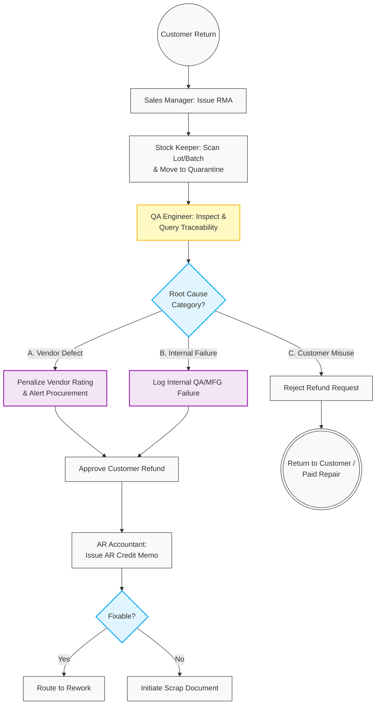

# 02. Customer Returns (RMA) & Traceability Resolution

## 1. Business Context
When a customer returns Finished Goods (FG), the Return Merchandise Authorization (RMA) process manages the inbound logistics, financial resolution, and root-cause analysis. Leveraging End-to-End Lot/Batch Traceability, the system categorizes the defect origin into three streams: **Vendor Failure** (raw materials), **Internal QA/Production Failure**, or **Customer Misuse**. This categorization dictates whether the customer receives a refund (Credit Memo) and whether internal or external corrective actions are triggered.

## 2. Business Process Flow

**Primary Actors:** Sales Manager, Stock Keeper, QA Engineer, AR Accountant, Procurement Manager.

### Process Steps:
1. **RMA Initiation:** The Sales Manager generates an RMA document linked to the original Sales Order.
2. **Inbound Receipt:** The Stock Keeper receives the goods, scans the Lot/Batch barcode, and routes them to **[Quarantine]**.
3. **QA Inspection & Root-Cause Categorization:** 
    The QA Engineer tests the item, queries the Traceability history, and assigns a Root Cause:
    *   **Category A (Vendor Defect):** Traced to faulty raw materials. System penalizes the Vendor Rating and alerts Procurement.
    *   **Category B (Internal Failure):** Traced to a gap in internal manufacturing or missed QA testing. System logs the failure for internal process review.
    *   **Category C (Customer Misuse):** Product failed due to improper handling by the end-user.
4. **Financial Resolution:** 
    *   If Category A or B: The AR Accountant issues an **AR Credit Memo** to refund the customer.
    *   If Category C: The Credit Memo is rejected. The customer is notified, and the item is either returned to them or routed for paid repair.
5. **Inventory Disposition:** Defective FG is routed to a Rework Order or written off via a Scrap Document.

---

## 3. Workflow Diagram

___

## 4. Key User Stories

*   **US-RMA-01:** As a QA Engineer, I want to query the Lot/Batch barcode of a returned item to categorize the root cause as Vendor Defect, Internal Failure, or Customer Misuse.
*   **US-RMA-02:** As the System, I want to automatically update the Vendor Rating and alert Procurement if an RMA is categorized as a Vendor Defect.
*   **US-RMA-03:** As an AR Accountant, I want the system to block the creation of an AR Credit Memo if QA categorizes the defect as Customer Misuse, preventing unjustified refunds.
*   **US-RMA-04:** As the System, I want to log all Internal Failure root causes to a central QA dashboard so that management can track and improve manufacturing gaps.

  
